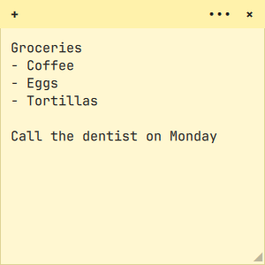

# Sticky Notes for Omarchy

Windows-style sticky notes for the [Omarchy](https://omarchy.org) shell. Each note is a small
surface that sits on your desktop, behind your windows. You can bring all notes in front of your
windows whenever you want to read or edit them.



## Features

- Notes live on the desktop layer, so they don't cover tiled windows
- Toggle every note in front of windows and back again
- Drag a note by its header, resize it from the bottom-right corner
- 7 colors from the Windows Sticky Notes palette, plus a **theme** color that follows your Omarchy theme
- A new note takes keyboard focus so you can start typing right away
- Autosaves to `~/.local/share/omarchy-sticky-notes.json`, including each note's position, size, color and monitor
- Works with multiple monitors

## Install

```bash
omarchy plugin add https://github.com/jglemusb-code/omarchy-sticky-notes.git --enable --yes
```

Then add keybindings to `~/.config/hypr/bindings.lua`:

```lua
o.bind("SUPER + ALT + N", "New sticky note", "omarchy-shell shell summon jglemusb.sticky-notes '{\"action\":\"new\"}'")
o.bind("SUPER + SHIFT + ALT + N", "Sticky notes front/desktop", "omarchy-shell shell toggle jglemusb.sticky-notes")
```

## Usage

| Action | How |
|---|---|
| New note | `SUPER ALT + N`, the **+** button on a note, or `Ctrl + N` inside a note |
| Bring notes in front of windows / back to the desktop | `SUPER SHIFT ALT + N` |
| Move | Drag the header |
| Resize | Drag the bottom-right corner |
| Change color | **•••** in the header |
| Delete | **×** in the header. A note with text asks you to click again to confirm |

To type in a note that's already open, click it. Click any window to give it the keyboard back.

### Shell commands

```bash
omarchy-shell shell summon jglemusb.sticky-notes '{"action":"new"}'    # new note
omarchy-shell shell summon jglemusb.sticky-notes '{"action":"front"}'  # notes in front of windows
omarchy-shell shell summon jglemusb.sticky-notes '{"action":"back"}'   # notes back on the desktop
omarchy-shell shell toggle jglemusb.sticky-notes                       # flip between the two
```

## Files

| File | Purpose |
|---|---|
| `manifest.json` | Plugin manifest (`panel` kind, `keepLoaded`) |
| `StickyNotes.qml` | Note list, persistence, and shell `open`/`close` handling |
| `Note.qml` | One note surface |
| `HeaderButton.qml` | Header button |
| `Palette.js` | Note colors and size limits |

## License

MIT
